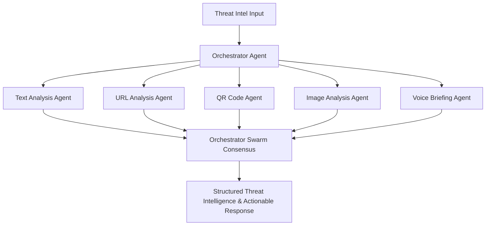

# ThreatWeave — Agentic Multimodal Cyber Threat Intelligence & Response

ThreatWeave is an advanced, end-to-end framework designed to process and coordinate threat response workflows by leveraging agentic multimodal intelligence. The platform aggregates, parses, and acts upon complex, multi-format cyber threat data—ranging from raw textual logs and network URLs to binary payloads, image screenshots, QR codes, and voice briefings. By routing inputs through an orchestrator-directed swarm of specialized AI agents, ThreatWeave provides real-time detection, contextualized mapping to attack matrices, and automated response playbooks, establishing a state-of-the-art model for modern, multimodal threat operations.

## Architecture

ThreatWeave relies on a six-agent hierarchical swarm architecture to analyze multimodal threat intelligence inputs:



- **Orchestrator Agent**: Acts as the central coordinator. Inspects incoming payloads (which can combine text, voice, images, etc.), decides which specialized sub-agents need to run, routes tasks, compiles responses, and formats the consensus analysis.
- **Text Analysis Agent**: Reviews structured/unstructured reports, logs, system events, and email headers to identify indicators of compromise (IoCs) and CVE references.
- **URL Analysis Agent**: Performs sandboxed safety analysis, DNS lookups, and web content checks on suspicious links.
- **QR Code Agent**: Decodes and inspects quick response (QR) codes embedded in phishing images or physical documents to extract redirect destinations and hidden payloads.
- **Image Analysis Agent**: Evaluates visual inputs such as threat dashboard screenshots, phishing emails, or ransomware screens for visual patterns of attack.
- **Voice Agent**: Transcribes and analyzes audio briefs, voice notes, and threat alerts to extract actionable key facts and speaker tone profiles.

## Tech Stack

- **API Backend**: Python 3.10+, FastAPI (Asynchronous framework), Uvicorn (ASGI server)
- **Frontend Dashboard**: Next.js (Node.js framework)
- **Agent Orchestration**: LangGraph & LangChain (Directed agent state loops)
- **Vector Database**: ChromaDB (RAG & contextual semantic embeddings)
- **Relational Database**: PostgreSQL (Persistent states, users, and histories)
- **Task Automation**: n8n (Visual integrations and playbooks)
- **Deployment**: Docker, Docker Compose, NGINX

---

## How to Run

### 1. Configure the Environment
Copy the example environment file and configure the settings. Note that the application requires valid API keys to function in production:
```bash
cp .env.example .env
```

### 2. Run Database Infrastructure
Start the persistent databases using Docker Compose:
```bash
docker-compose up -d
```
This launches:
- **PostgreSQL 16**: Port `5432`
- **ChromaDB**: Port `8001` (container internal `8000`)

### 3. Run and Verify the API
Navigate to the API folder, activate the virtual environment, install the packages, and run the FastAPI server:
```bash
cd apps/api
python -m venv venv
source venv/bin/activate  # On Windows: .\venv\Scripts\activate
pip install -r requirements.txt
uvicorn app.main:app --reload --port 8000
```

Verify that the health check is active and running:
```bash
curl http://localhost:8000/health
```
**Expected Response:**
```json
{"status":"ok","service":"threatweave-api"}
```

### 4. Run and Verify the Frontend
Navigate to the web folder, install the npm dependencies, and run the Next.js development server:
```bash
cd apps/web
npm install
npm run dev
```
Open [http://localhost:3000](http://localhost:3000) in your browser to inspect the ThreatWeave SOC Console, showcase tokens, and reusable component libraries.

